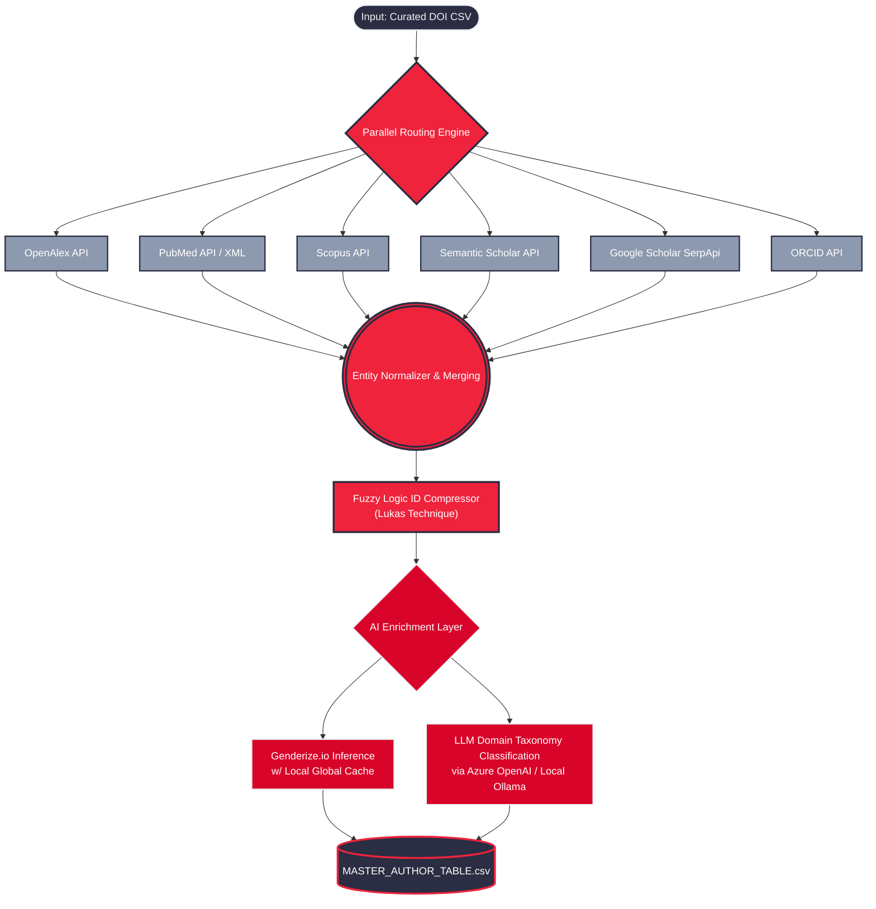

# Scientometric Analysis Tool

Welcome to the **Scientometric Analysis Tool**, a state-of-the-art framework crafted to extract, normalize, and enrich massive bibliometric data for high-level academic research. Designed for mass data processing, this tool automates the extraction of complex researcher profiles, calculating h-indices, seniority, citation metrics, and affiliations across five major scientific endpoints.

## Architecture Overview (A1 Version)

The system operates by receiving a curated list of paper DOIs. It then branches out concurrently to query various academic endpoints, normalizes nested JSON outputs, and finally consolidates the records into a single flattened matrix (`MASTER_AUTHOR_TABLE.csv`).

The **A1 Production Release** features both a highly optimized **Python CLI** engine for mass processing and an **n8n Workflow** for event-driven orchestration. Both flavors integrate identical matrix normalization logic and Large Language Model (LLM) classification.

---

### System Flowchart

The following diagram visualizes how a raw Document Object Identifier (DOI) cascades through our extraction nodes and emerges as an enriched researcher profile matrix.

---

## Features

* **Multi-Database Federation:** Seamless integration natively parsing from Scopus, PubMed, OpenAlex, Semantic Scholar, Google Scholar and ORCID APIs.
* **Deterministic Normalization:** Unrolls "1-to-N" authorships matrices, dynamically capturing strict index positioning (first, middle, last author).
* **Metric Calculation on Runtime:** Dynamically computes derived metrics such as academic seniority and continuous publishing streaks without downstream processing.
* **Smart Rate Limiting:** Asynchronous threading (`time.sleep` payloads) and chunking logic ensures immunity to HTTP 429 Too Many Requests errors.
* **LLM Semantic Profiling:** Incorporates `gpt-4o-mini` (or locally hosted `llama3`) to read unstructured affiliations, interests, and keywords to deduce deterministic domains (e.g. CLINICAL vs. COMPUTER_SCIENCE) while mitigating hallucinations.
* **Identity Compression:** Deduplicates and maps entities securely via associative arrays and string proximity metrics.

## Deliverables Structure

* **`/A1/PYTHON`**: Python implementation natively engineered for maximal performance and minimal footprint logic on bulk DOI parsing.
* **`/A1/N8N`**: Complete visual n8n workflow file and Docker Compose architecture for automated, cloud-connected pipeline deployment.

---

> *"From chaotic Boolean strings to precise DOIs. Determinism by Design."*
